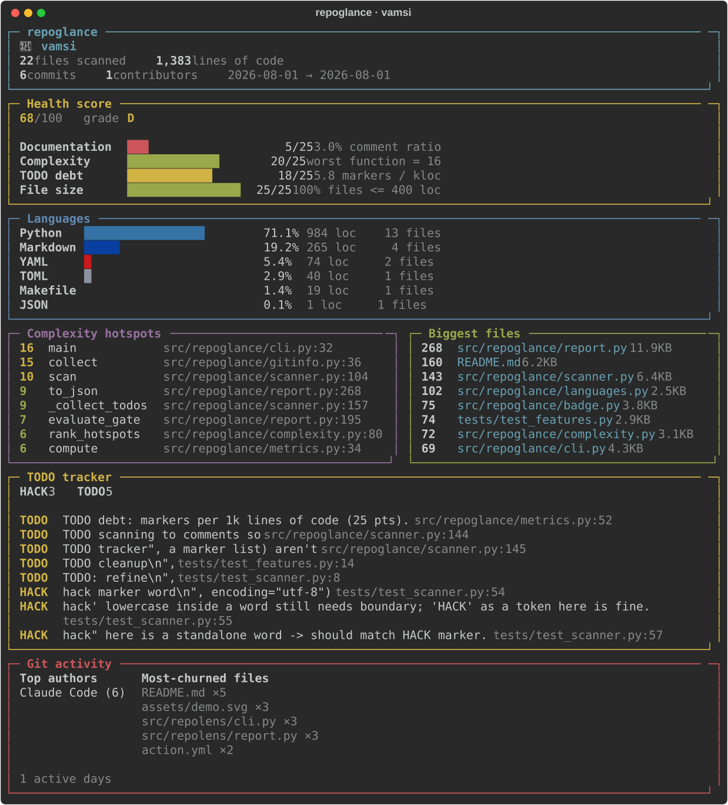
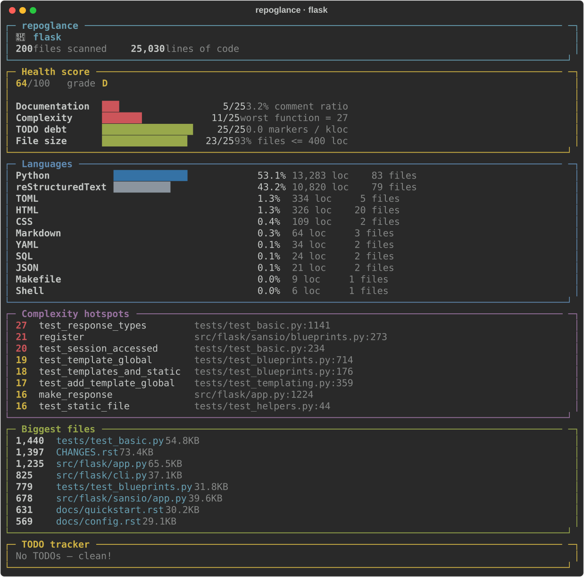

<div align="center">

# 🔍 repoglance

### Instant, gorgeous insight into any code repository — in one command.

Point it at any folder. In under a second you get a beautiful terminal report:
language breakdown, complexity hotspots, TODO tracker, biggest files, and git
activity. **Zero config. Zero API keys. Zero telemetry.**

[](https://github.com/SRJ-ai/repoglance/actions/workflows/ci.yml)
[](https://www.python.org/)
[](LICENSE)
[](CONTRIBUTING.md)
[](https://github.com/SRJ-ai/repoglance)

</div>

---

## Why repoglance?

You clone an unfamiliar repo. What *is* this thing? How big? What's the messy
part? Where's the unfinished work? `cloc` gives you a wall of numbers. `tokei`
is fast but bare. `repoglance` answers the human questions in one glance:

```bash
repoglance .
```

<div align="center">



</div>

## Seen in the wild

repoglance run against well-known projects (click to view the full report):

| Project | Files | Lines of code | Health |
|---|--:|--:|:--:|
| [flask](assets/showcase/flask.svg) | 209 | 25,293 | D (64) |
| [httpie](assets/showcase/httpie.svg) | 236 | 20,114 | D (62) |
| [requests](assets/showcase/requests.svg) | 89 | 13,785 | C (70) |

<div align="center">

[](assets/showcase/flask.svg)

</div>

## Install

```bash
pip install repoglance
```

Or run without installing:

```bash
pipx run repoglance .
```

## Usage

```bash
repoglance                       # analyze current directory
repoglance path/to/repo          # analyze another repo
repoglance --json                # machine-readable output for scripts / CI
repoglance --svg report.svg      # export a vector report
repoglance --html report.html    # export a browser report
repoglance --badge badge.svg     # export an embeddable badge
repoglance --ci --max-complexity 25   # fail CI on hotspots
repoglance --no-git              # skip git history
repoglance --ignore dist --ignore fixtures
```

### JSON output

Pipe structured data anywhere — dashboards, CI gates, badges:

```bash
repoglance --json | jq '.languages.Python.code'
```

## What it measures

| Section | What you get |
|---|---|
| **Languages** | Lines of code per language, ranked, with % bars |
| **Complexity hotspots** | Per-function cyclomatic complexity (Python via AST; heuristic for other langs) |
| **TODO tracker** | Every `TODO` / `FIXME` / `HACK` / `XXX` / `BUG` with file:line |
| **Biggest files** | The files most likely to need splitting |
| **Git activity** | Top authors, most-churned files, active days, project lifespan |

Binary files, `node_modules`, `.venv`, build dirs and friends are skipped
automatically.

## More than a counter

`repoglance` isn't just another `cloc`. Tools like `tokei`, `cloc` and `scc`
answer *"how many lines?"*. repoglance answers *"what should I look at?"* — and
gives you artifacts you can put in a PR or a README.

| | repoglance | tokei | scc | cloc |
|---|:---:|:---:|:---:|:---:|
| Lines-of-code by language | ✅ | ✅ | ✅ | ✅ |
| Complexity hotspots (per function) | ✅ | ❌ | ⚠️ file-level | ❌ |
| TODO / FIXME tracker | ✅ | ❌ | ❌ | ❌ |
| Git activity (authors, churn) | ✅ | ❌ | ❌ | ❌ |
| JSON output | ✅ | ✅ | ✅ | ✅ |
| **HTML / SVG report export** | ✅ | ❌ | ❌ | ❌ |
| **Embeddable repo badge** | ✅ | ❌ | ❌ | ❌ |
| **CI gate (`--max-complexity`)** | ✅ | ❌ | ❌ | ❌ |
| Zero install deps beyond one `pip` | ✅ | (binary) | (binary) | (perl) |

## Share it: badges & reports

Generate a self-contained SVG badge — no shields.io round-trip, no tracking:

```bash
repoglance --badge assets/badge.svg
```


Export the full report as a standalone file to drop in a PR or wiki:

```bash
repoglance --svg report.svg      # vector, pixel-perfect
repoglance --html report.html    # opens in any browser
```

## Guard your codebase in CI

Fail the build when complexity or TODO debt crosses a line:

```bash
repoglance --ci --max-complexity 25 --max-todos 100
```

```yaml
# .github/workflows/quality.yml
- run: pip install repoglance
- run: repoglance --ci --max-complexity 25
```

Exit code `0` = clean, `2` = a threshold was exceeded.

## Integrations

### GitHub Action — comment on every PR

Drop repoglance into any repo. It posts a sticky report comment on pull requests
and can gate the build:

```yaml
# .github/workflows/repoglance.yml
name: repoglance
on: [pull_request]
permissions:
  contents: read
  pull-requests: write
jobs:
  analyze:
    runs-on: ubuntu-latest
    steps:
      - uses: actions/checkout@v4
      - uses: SRJ-ai/repoglance@main
        with:
          fail-under: "70"       # optional health gate
          max-complexity: "25"   # optional complexity gate
```

The report also lands in the workflow's **job summary** every run.

### pre-commit hook

```yaml
# .pre-commit-config.yaml
repos:
  - repo: https://github.com/SRJ-ai/repoglance
    rev: v0.2.2
    hooks:
      - id: repoglance
        args: ["--ci", "--fail-under", "70"]
```

### Self-updating badge

Commit a shields endpoint file and point a dynamic badge at it — the badge
refreshes itself, no service to run:

```bash
repoglance --badge-json .repoglance-badge.json   # commit this file
```

```markdown

```

### Markdown anywhere

```bash
repoglance --md   # paste into a PR, wiki, or Slack
```

## Design goals

- **Fast** — a single pass, no external services.
- **Honest** — no network, no telemetry, no surprise writes.
- **Pretty** — powered by [rich](https://github.com/Textualize/rich).
- **Scriptable** — everything the report shows is available as `--json`.

## Contributing

Adding a language is a one-line change in `languages.py`. PRs welcome — see
[CONTRIBUTING.md](CONTRIBUTING.md).

## License

[MIT](LICENSE) © repoglance contributors
